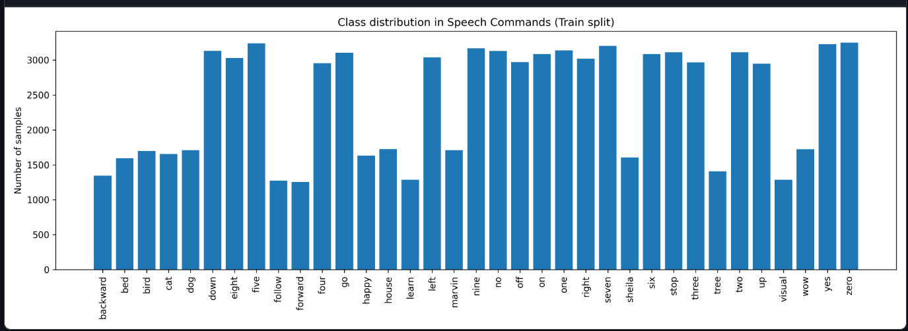
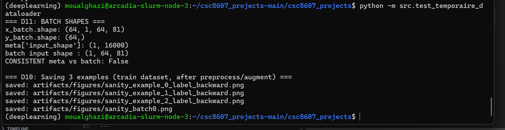
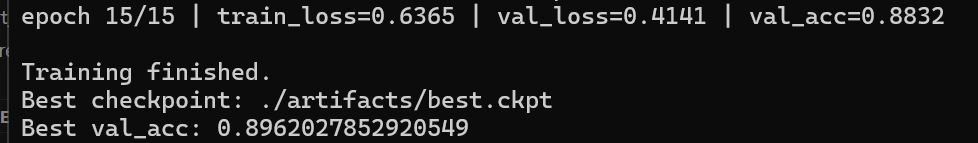
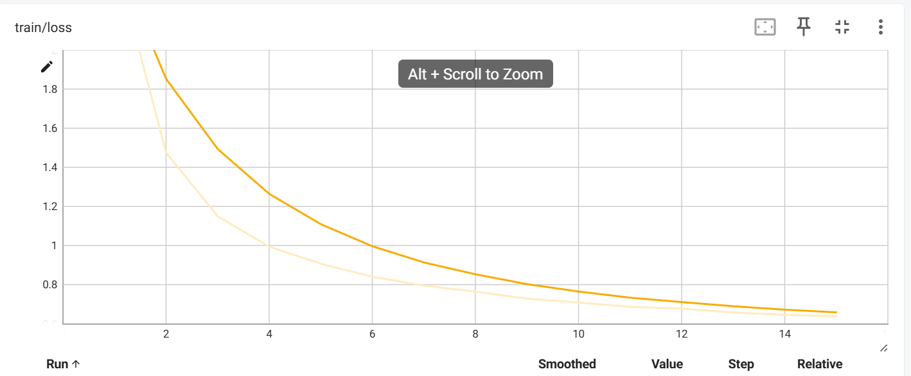
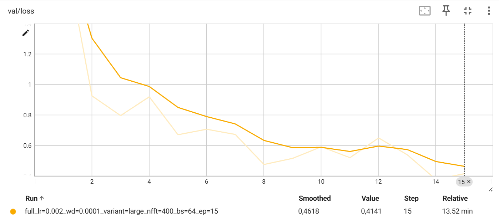
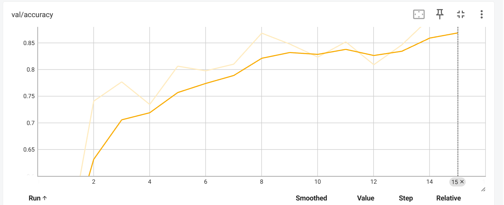
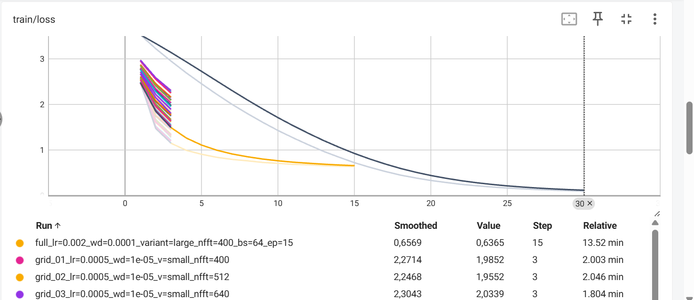
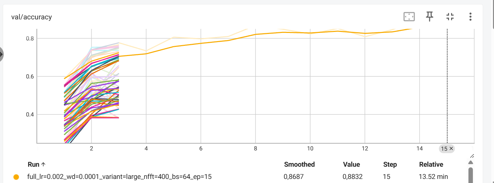
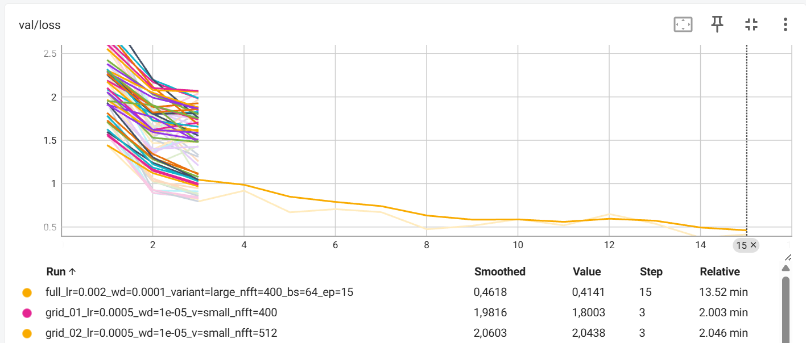
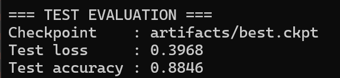

# Rapport de projet — CSC8607 : Introduction au Deep Learning

> **Consignes générales**
> - Tenez-vous au **format** et à l’**ordre** des sections ci-dessous.
> - Intégrez des **captures d’écran TensorBoard** lisibles (loss, métriques, LR finder, comparaisons).
> - Les chemins et noms de fichiers **doivent** correspondre à la structure du dépôt modèle (ex. `runs/`, `artifacts/best.ckpt`, `configs/config.yaml`).
> - Répondez aux questions **numérotées** (D1–D11, M0–M9, etc.) directement dans les sections prévues.

---

## 0) Informations générales

- **Étudiant·e** : _OUALGHAZI, Mohamed_
- **Projet** : _Speech Commands v0.02 (reconnaissance de mots courts) avec CNN sur spectrogrammes log-mel_
- **Dépôt Git** : _URL publique_
- **Environnement** : `python == 3.10.18`, `torch == 2.5.1`, `cuda == 12.1`  
- **Commandes utilisées** :
  - Entraînement : `python -m src.train --config configs/config.yaml`
  - LR finder : `python -m src.lr_finder --config configs/config.yaml`
  - Grid search : `python -m src.grid_search --config configs/config.yaml`
  - Évaluation : `python -m src.evaluate --config configs/config.yaml --checkpoint artifacts/best.ckpt`

---

## 1) Données

### 1.1 Description du dataset
- **Source**: [torchaudio.datasets.SPEECHCOMMANDS](https://docs.pytorch.org/audio/stable/datasets.html#speechcommands)
- **Type d’entrée** : Audio  
- **Tâche** : multiclasses
- **Dimensions d’entrée attendues** (`meta["input_shape"]`) :  [1, 64, 81]
- **Nombre de classes** (`meta["num_classes"]`) :35 classes


### 1.2 Splits et statistiques

| Split | #Exemples | Particularités (déséquilibre, longueur moyenne, etc.) |
|------:|----------:|--------------------------------------------------------|
| Train |   84843        |              Légers déséquilibres entre classes (≈ 1 200 à 3 300 échantillons par classe)                                          |
| Val   | 9981          |                            Même distribution que le train (split officiel du dataset)                            |
| Test  |  11005         |                              Distribution similaire, utilisé uniquement pour l’évaluation finale                          |

**D2.** Donnez la taille de chaque split et le nombre de classes.  
**D3.** Si vous avez créé un split (ex. validation), expliquez **comment** (stratification, ratio, seed).

**D4.** Donnez la **distribution des classes** (graphique ou tableau) et commentez en 2–3 lignes l’impact potentiel sur l’entraînement.  

La figure ci-dessus montre la distribution des classes dans le split train du dataset Speech Commands v0.02. Les classes sont globalement bien équilibrées, avec la majorité des mots contenant environ 3 000 à 3 300 échantillons. Certaines classes (par ex. backward, follow, learn, visual) disposent toutefois de moins d’exemples (≈ 1 200–1 400).

**Impact sur l’entraînement :**
Ce léger déséquilibre peut conduire le modèle à être moins performant sur les classes minoritaires, surtout en début d’entraînement.

**D5.** Mentionnez toute particularité détectée (tailles variées, longueurs variables, multi-labels, etc.).
- Chaque exemple est mono-label (un seul mot par audio), donc il s’agit bien d’une classification multi-classe (35 classes)

### 1.3 Prétraitements (preprocessing) — _appliqués à train/val/test_

Listez précisément les opérations et paramètres (valeurs **fixes**) :

- Audio :  
 resample = 16 000 Hz,
 Fixation de la durée : pad / truncate à 1 seconde = 16 000 échantillons,
  mel-spectrogram (n_mels=64, n_fft=400, hop_length=200), AmplitudeToDB(stype="power", top_db=80),
  Normalisation.


**D6.** Quels **prétraitements** avez-vous appliqués (opérations + **paramètres exacts**) et **pourquoi** ? 

Tous les signaux audio sont d’abord resamplés à 16 kHz afin d’uniformiser les données provenant de différents enregistrements. Les signaux sont ensuite pad/truncate à une durée fixe de 1 seconde, ce qui garantit une entrée de taille constante et facilite l’entraînement d’un CNN.

Le signal temporel est transformé en spectrogramme log-mel, une représentation utilisée en reconnaissance vocale car elle capture efficacement les informations fréquentielles pertinentes pour la perception humaine. Enfin, une normalisation standard est appliquée afin de stabiliser l’optimisation et d’accélérer la convergence du modèle.

**D7.** Les prétraitements diffèrent-ils entre train/val/test (ils ne devraient pas, sauf recadrage non aléatoire en val/test) ?  
Les prétraitements sont strictement identiques pour les ensembles train, validation et test.

### 1.4 Augmentation de données — _train uniquement_

- Liste des **augmentations** (opérations + **paramètres** et **probabilités**) :
* Frequency Masking

  * freq_mask_param = 8

  * num_freq_masks = 1

* Time Masking

  * time_mask_param = 20

  * num_time_masks = 1

Ces transformations masquent aléatoirement certaines bandes fréquentielles et temporelles du spectrogramme.

**D8.** Quelles **augmentations** avez-vous appliquées (paramètres précis) et **pourquoi** ?  

L’augmentation utilisée est SpecAugment, composée de masquages fréquentiels et temporels. Cette méthode permet de simuler des variations acoustiques (bruit, coupures, variations de prononciation) sans modifier le contenu sémantique du signal. Elle améliore ainsi la robustesse du modèle et réduit le surapprentissage.

**D9.** Les augmentations **conservent-elles les labels** ? Justifiez pour chaque transformation retenue.

les augmentations conservent les labels.
Les opérations de Time Masking et Frequency Masking n’altèrent pas le mot prononcé, mais uniquement sa représentation spectrale. Le contenu linguistique reste inchangé, ce qui garantit que le label associé à chaque exemple demeure correct.

### 1.5 Sanity-checks

- **Exemples** après preprocessing/augmentation (insérer 2–3 images/spectrogrammes) :


**D10.** Montrez 2–3 exemples et commentez brièvement.  
Les spectrogrammes log-mel (1×64×81) montrent l’énergie répartie sur les bandes fréquentielles au cours du temps. Après augmentation (SpecAugment), certaines zones temporelles/fréquentielles peuvent être masquées, ce qui force le modèle à apprendre des motifs plus robustes et améliore la généralisation.  

**D11.** Donnez la **forme exacte** d’un batch train (ex. `(batch, C, H, W)` ou `(batch, seq_len)`), et vérifiez la cohérence avec `meta["input_shape"]`.
La forme d’un batch train est (batch, C, F, T) = (64, 1, 64, 81). La cohérence est vérifiée car meta["input_shape"] = (1, 64, 81) correspond exactement à x_batch.shape[1:].

---

## 2) Modèle

### 2.1 Baselines

**M0.**
- **Classe majoritaire** — Métrique : `Accuracy` → score = `3.80%`
- **Prédiction aléatoire uniforme** — Métrique : `Accuracy` → score = `2.73%`  
- **Prédiction aléatoire pondérée** — Métrique : `Accuracy` → score = `3.04%` 

### 2.2 Architecture implémentée

- **Description couche par couche** (ordre exact, tailles, activations, normalisations, poolings, résiduels, etc.) :
  - Input → (B, 1, 64, 81) (batch, canal, freq, temps)
  - Stage 1: Conv2d(1→C1, 3×3, pad=1) → BatchNorm2d(C1) → ReLU → MaxPool2d(2×2)
  - Stage 2: Conv2d(C1→C2, 3×3, pad=1) → BatchNorm2d(C2) → ReLU → MaxPool2d(2×2)
  - Stage 3: Conv2d(C2→C3, 3×3, pad=1) → BatchNorm2d(C3) → ReLU → Global Average Pooling (AdaptiveAvgPool2d(1,1))
  - Tête (Linear(C3 → num_classes=35) → logits 

- **Loss function** :
  - Multi-classe : CrossEntropyLoss


- **Sortie du modèle** : forme = __(batch_size, num_classes)__ (ou __(batch_size, num_attributes)__)
(batch_size, num_classes) = (64, 35) 

- **Nombre total de paramètres** : `97411`


**M1.** Décrivez l’**architecture** complète et donnez le **nombre total de paramètres**.  
Expliquez le rôle des **2 hyperparamètres spécifiques au modèle** (ceux imposés par votre sujet).

Les deux hyperparamètres spécifiques au modèle sont :

- Le nombre de canaux par bloc (C1, C2, C3)  
 contrôle la capacité du réseau (plus de canaux = plus de paramètres).

- La taille de la fenêtre FFT (n_fft) du MelSpectrogram  
 impacte la résolution temps/fréquence des entrées et donc la qualité des représentations spectrales.


### 2.3 Perte initiale & premier batch

- **Loss initiale attendue** (multi-classe) ≈ `-log(1/num_classes)` ; exemple 35 classes → ~3.56
- **Observée sur un batch** : `3.63`
- **Vérification** : backward OK, gradients ≠ 0  

Cette valeur est cohérente avec la valeur théorique attendue -log(1/35) ≈ 3.56 pour une classification multi-classe uniforme.
Le backward est valide et les gradients sont non nuls, confirmant le bon fonctionnement du pipeline modèle–loss.

**M2.** Donnez la **loss initiale** observée et dites si elle est cohérente. Indiquez la forme du batch et la forme de sortie du modèle.

---

## 3) Overfit « petit échantillon »

- **Sous-ensemble train** : `N = 128` exemples
- **Hyperparamètres modèle utilisés** (les 2 à régler) : `channels_variant = small(32,64,128) (nombre de canaux par bloc CNN)`, `n_fft = 400`
- **Optimisation** : LR = `1e-3`, weight decay = `0` (0 ou très faible recommandé)
- **Nombre d’époques** : `30`


**M3.** Donnez la **taille du sous-ensemble**, les **hyperparamètres** du modèle utilisés, et la **courbe train/loss** (capture). Expliquez ce qui prouve l’overfit.

L’overfit est réalisé sur un très petit sous-ensemble d’entraînement de 128 exemples.
La courbe train/loss montre une diminution rapide et monotone de la loss, passant d’environ 3.5 (valeur initiale cohérente avec une classification multi-classes à 35 classes) à une valeur proche de 0 après une trentaine d’époques.  
Ce comportement prouve l’overfit, car le modèle est capable de mémoriser intégralement ce petit ensemble de données.

---

## 4) LR finder

- **Méthode** : balayage du learning rate en échelle logarithmique sur 100 itérations, en enregistrant la loss pour chaque valeur de LR.
- **Fenêtre stable retenue** : `1e-3 → 1e-2`
- **Choix pour la suite** :
  - **LR** = `1e-3`
  - **Weight decay** = `1e-4` (valeurs classiques : 1e-5, 1e-4)


**M4.** Justifiez en 2–3 phrases le choix du **LR** et du **weight decay**.  
Le LR choisi correspond à la zone où la loss diminue de manière stable avant de devenir instable lorsque le LR augmente trop. Des valeurs supérieures provoquent des oscillations et une divergence de la perte. Le weight decay est fixé à 1e-4 afin d’introduire une régularisation légère sans empêcher l’apprentissage.

---

## 5) Mini grid search (rapide)


- **Grilles** :
  - LR : `{5e-4 , 1e-3 , 2e-3}`
  - Weight decay : `{1e-5, 1e-4}`
  - Hyperparamètre modèle A : `{small, large}`((32,64,128):small, (48,96,192):large)
  - Hyperparamètre modèle B : `{400, 512, 640}`

- **Durée des runs** : `3` époques par run (1–5 selon dataset), même seed

| Run (nom explicite) | LR    | WD     | Hyp-A | Hyp-B | Val metric (nom=accuracy) | Val loss | Notes |
|---------------------|-------|--------|-------|-------|-------------------------|----------|-------|
|grid_34_lr=0.002_wd=0 0001_v=large_nfft=400|  0.002|   1e-4| large|   400    |       0.7768                  |    0.7952      |   meilleur run    |
|    grid_30_lr=0.002_wd=1e-05_v=large_nfft=640                 |   0.002    |     1e-5   |    large   |    640   |              0.7671           |       0.8196   |    proche du best   |


**M5.** Présentez la **meilleure combinaison** (selon validation) et commentez l’effet des **2 hyperparamètres de modèle** sur les courbes (stabilité, vitesse, overfit).

La meilleure combinaison sur validation après 3 époques est :
LR = 0.002, weight decay = 1e-4, channels_variant = large, n_fft = 400 (val_accuracy ≈ 0.7768, val_loss ≈ 0.7952).

On observe que channels_variant = large améliore la performance par rapport à small, ce qui est cohérent avec une capacité plus grande (plus de canaux → modèle plus expressif). En contrepartie, cela peut augmenter le risque d’overfit sur un entraînement long, d’où l’intérêt d’un weight decay non nul.

Le paramètre n_fft contrôle la résolution temps/fréquence du spectrogramme :

* un n_fft plus petit (400) donne une meilleure résolution temporelle, ce qui semble avantageux ici pour des mots courts (~1 seconde),

* des valeurs plus grandes (512/640) restent compétitives mais légèrement en dessous dans cette grille courte.
---

## 6) Entraînement complet (10–20 époques, sans scheduler)








- **Configuration finale** :
  - LR = `0.002`
  - Weight decay = `1e-4`
  - Hyperparamètre modèle A = `channels_variant = large`
  - Hyperparamètre modèle B = `n_fft = 400`
  - Batch size = `64`
  - Époques = `15` (10–20)
- **Checkpoint** : `artifacts/best.ckpt` (selon meilleure métrique val)
* Meilleur epoch : 14
* Best val_accuracy = 0.8962

**M6.** Montrez les **courbes train/val** (loss + métrique). Interprétez : sous-apprentissage / sur-apprentissage / stabilité d’entraînement.  
Les courbes train/loss et val/loss montrent une diminution nette au début puis un plateau progressif, tandis que val/accuracy augmente rapidement jusqu’à environ 0.90. L’entraînement est globalement stable : pas de divergence, et les fluctuations de val/loss restent modérées.
Le meilleur modèle est obtenu à l’epoch 14 (val_accuracy ≈ 0.896). On n’observe pas de sur-apprentissage marqué, car la performance validation reste élevée et la loss validation ne remonte pas durablement.

---

## 7) Comparaisons de courbes (analyse)





- **Variation du LR** (impact au début d’entraînement)Un LR plus élevé (0.002) accélère fortement la convergence et améliore l’accuracy de validation, conformément aux attentes issues du LR finder.
- **Variation du weight decay** (écart train/val, régularisation) Une régularisation plus forte (1e-4) réduit l’écart train/val et améliore la stabilité, limitant le sur-apprentissage.
- **Variation des 2 hyperparamètres de modèle** Les modèles large avec n_fft = 400 convergent plus vite et atteignent de meilleures performances, confirmant que plus de capacité et une meilleure résolution temporelle sont bénéfiques pour cette tâche.


## 9) Évaluation finale (test)

- **Checkpoint évalué** : `artifacts/best.ckpt`
- **Métriques test** :
  - Metric principale (nom = `accuracy`) : `0.8846`
  - Metric(s) secondaire(s) test loss: `0.3968`


**M9.** Donnez les **résultats test** et comparez-les à la validation (écart raisonnable ? surapprentissage probable ?).  
Sur le jeu de test, le modèle atteint une accuracy de 0.8846 (loss = 0.3968). Cette performance est proche de celle obtenue en validation (best val_acc ≈ 0.8962), avec un écart d’environ 0.0116. Cet écart est raisonnable et suggère une bonne généralisation, avec un surapprentissage limité.

---

## 10) Limites, erreurs & bug diary (court)

- **Limites connues** (données, compute, modèle) :
  * Compute :  
Grid search limitée à peu d’époques pour des raisons de temps
  * Modèle :
CNN simple sans mécanisme temporel explicite (pas de RNN / attention)
- **Erreurs rencontrées** (shape mismatch, divergence, NaN…) et **solutions** :
  * Mismatch de dimensions entre spectrogrammes et modèle  
  → correction via un collate_fn avec padding/truncation

  * Incohérence entre meta["input_shape"] et batch réel  
  → vérification explicite avec sanity-checks

  * TensorBoard inaccessible via localhost sur serveur distant  
→ utilisation d’un tunnel SSH
- **Idées « si plus de temps/compute »** (une phrase) :
  * Ajouter un scheduler de LR

  * Tester un CRNN ou un modèle avec attention temporelle

  *  Augmenter la durée d’entraînement avec early stopping
---

## 11) Reproductibilité

- **Seed** : `42`
- **Config utilisée** : joindre un extrait de `configs/config.yaml` (sections pertinentes)
```bash
train:  
  seed: 42  
  batch_size: 64  
  epochs: 15  
  optimizer:  
    name: adam  
    lr: 0.002  
    weight_decay: 0.0001  
preprocess:   
  n_mels: 64  
  n_fft: 400           
augment:  
  spec_augment:  
    freq_mask_param: 8  
    time_mask_param: 20  
model:  
  num_classes: 35  
  channels_variant: large  
````

- **Commandes exactes** :

```bash
# Exemple 
python -m src.nbreparam
python -m src.loss_init
python -m src.overfit --config configs/config.yaml --n 128 --epochs 30 --lr 1e-3 --wd 0.0
python -m src.lr_finder --config configs/config.yaml --min_lr 1e-6 --max_lr 1 --num_iters 100
python -m src.grid_search --config configs/config.yaml --epochs 3
python -m src.train --config configs/config.yaml
python -m src.evaluate --config configs/config.yaml --checkpoint artifacts/best.ckpt

````

* **Artifacts requis présents** :

  * [ ] `runs/` (runs utiles uniquement)
  * [ ] `artifacts/best.ckpt`
  * [ ] `configs/config.yaml` aligné avec la meilleure config

---

## 12) Références (courtes)

* PyTorch docs des modules utilisés (Conv2d, BatchNorm, ReLU, LSTM/GRU, transforms, etc.).
* Lien dataset officiel (et/ou HuggingFace/torchvision/torchaudio).
* Toute ressource externe substantielle (une ligne par référence).


