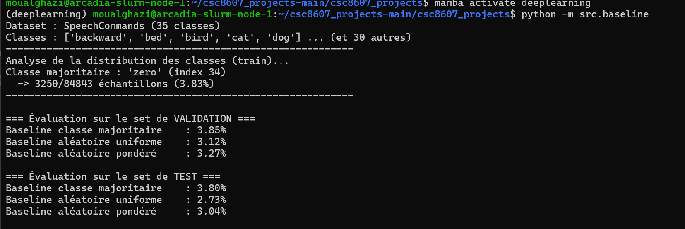
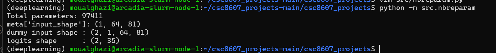
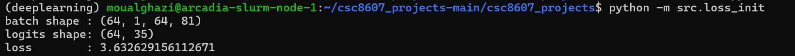
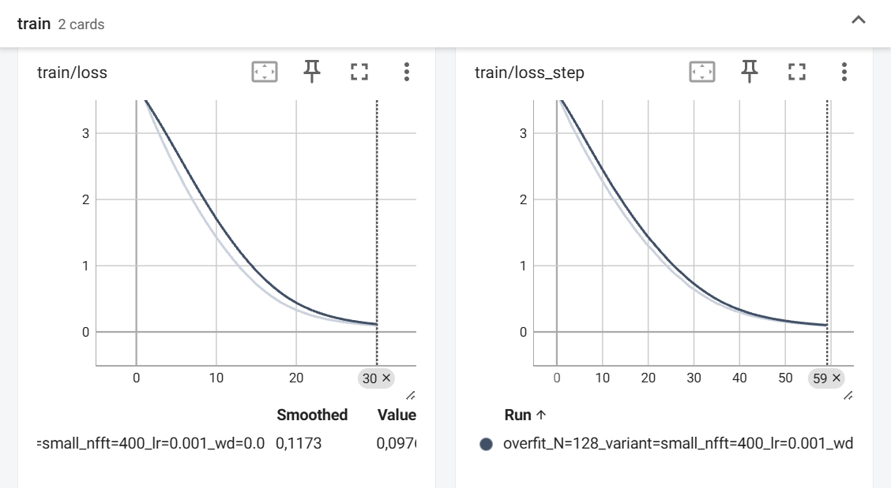
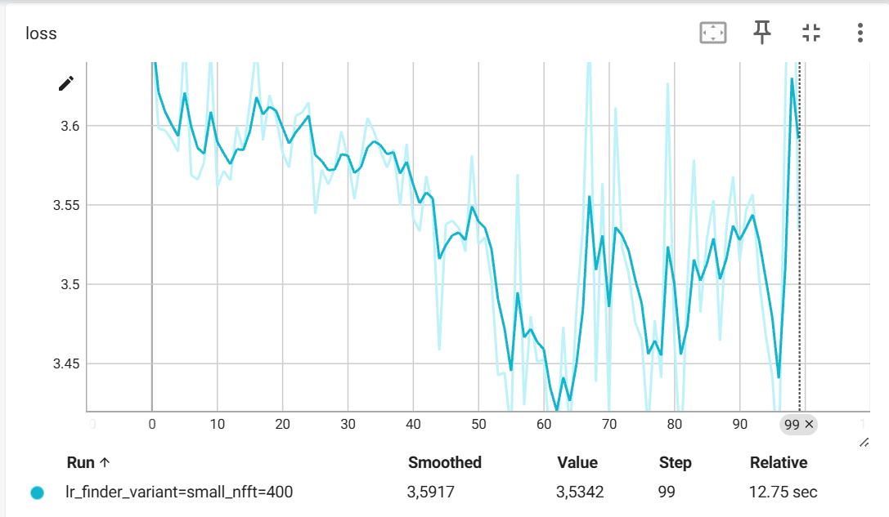
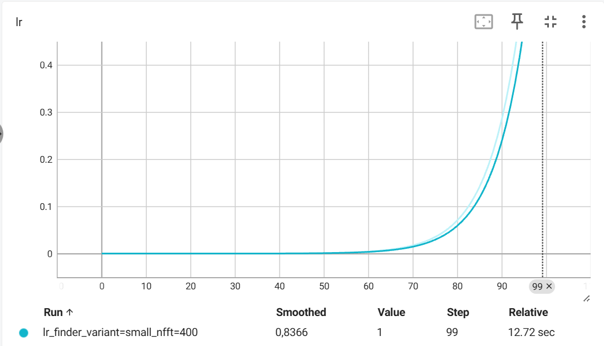
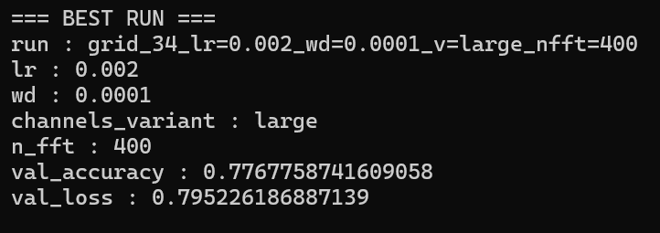
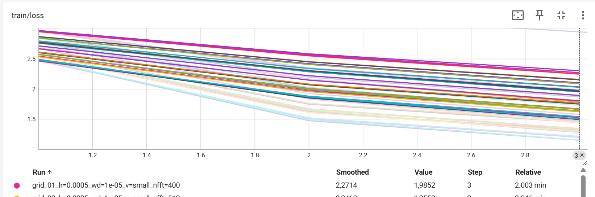
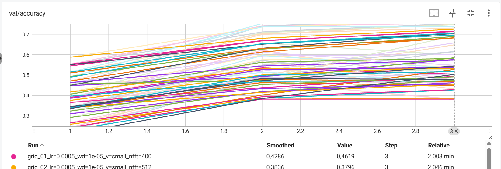
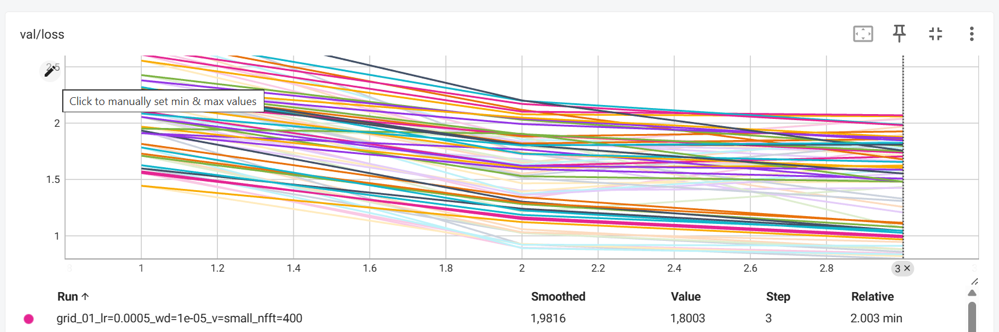

# Rapport de projet — CSC8607 : Introduction au Deep Learning

> **Consignes générales**
> - Tenez-vous au **format** et à l’**ordre** des sections ci-dessous.
> - Intégrez des **captures d’écran TensorBoard** lisibles (loss, métriques, LR finder, comparaisons).
> - Les chemins et noms de fichiers **doivent** correspondre à la structure du dépôt modèle (ex. `runs/`, `artifacts/best.ckpt`, `configs/config.yaml`).
> - Répondez aux questions **numérotées** (D1–D11, M0–M9, etc.) directement dans les sections prévues.

---

## 0) Informations générales

- **Étudiant·e** : _OUALGHAZI, Mohamed_
- **Projet** : _Speech Commands v0.02 (reconnaissance de mots courts) avec CNN sur spectrogrammes log-mel_
- **Dépôt Git** : _URL publique_
- **Environnement** : `python == 3.10.18`, `torch == 2.5.1`, `cuda == 12.1`  
- **Commandes utilisées** :
  - Entraînement : `python -m src.train --config configs/config.yaml`
  - LR finder : `python -m src.lr_finder --config configs/config.yaml`
  - Grid search : `python -m src.grid_search --config configs/config.yaml`
  - Évaluation : `python -m src.evaluate --config configs/config.yaml --checkpoint artifacts/best.ckpt`

---

## 1) Données

### 1.1 Description du dataset
- **Source**: [torchaudio.datasets.SPEECHCOMMANDS](https://docs.pytorch.org/audio/stable/datasets.html#speechcommands)
- **Type d’entrée** : Audio  
- **Tâche** : multiclasses
- **Dimensions d’entrée attendues** (`meta["input_shape"]`) :  [1, 64, 81]
- **Nombre de classes** (`meta["num_classes"]`) :35 classes

**D1.** Quel dataset utilisez-vous ? D’où provient-il et quel est son format (dimensions, type d’entrée) ?

### 1.2 Splits et statistiques

| Split | #Exemples | Particularités (déséquilibre, longueur moyenne, etc.) |
|------:|----------:|--------------------------------------------------------|
| Train |   84843        |                                                        |
| Val   | 9981          |                                                        |
| Test  |  11005         |                                                        |

**D2.** Donnez la taille de chaque split et le nombre de classes.  
**D3.** Si vous avez créé un split (ex. validation), expliquez **comment** (stratification, ratio, seed).

**D4.** Donnez la **distribution des classes** (graphique ou tableau) et commentez en 2–3 lignes l’impact potentiel sur l’entraînement.  


**D5.** Mentionnez toute particularité détectée (tailles variées, longueurs variables, multi-labels, etc.).

### 1.3 Prétraitements (preprocessing) — _appliqués à train/val/test_

Listez précisément les opérations et paramètres (valeurs **fixes**) :

- Vision : resize = __, center-crop = __, normalize = (mean=__, std=__)…
- Audio : resample = __ Hz, mel-spectrogram (n_mels=__, n_fft=__, hop_length=__), AmplitudeToDB…
- NLP : tokenizer = __, vocab = __, max_length = __, padding/truncation = __…
- Séries : normalisation par canal, fenêtrage = __…

**D6.** Quels **prétraitements** avez-vous appliqués (opérations + **paramètres exacts**) et **pourquoi** ?  
**D7.** Les prétraitements diffèrent-ils entre train/val/test (ils ne devraient pas, sauf recadrage non aléatoire en val/test) ?

### 1.4 Augmentation de données — _train uniquement_

- Liste des **augmentations** (opérations + **paramètres** et **probabilités**) :
  - ex. Flip horizontal p=0.5, RandomResizedCrop scale=__, ratio=__ …
  - Audio : time/freq masking (taille, nb masques) …
  - Séries : jitter amplitude=__, scaling=__ …

**D8.** Quelles **augmentations** avez-vous appliquées (paramètres précis) et **pourquoi** ?  
**D9.** Les augmentations **conservent-elles les labels** ? Justifiez pour chaque transformation retenue.

### 1.5 Sanity-checks

- **Exemples** après preprocessing/augmentation (insérer 2–3 images/spectrogrammes) :

> _Insérer ici 2–3 captures illustrant les données après transformation._

**D10.** Montrez 2–3 exemples et commentez brièvement. 
Les spectrogrammes log-mel (1×64×81) montrent l’énergie répartie sur les bandes fréquentielles au cours du temps. Après augmentation (SpecAugment), certaines zones temporelles/fréquentielles peuvent être masquées, ce qui force le modèle à apprendre des motifs plus robustes et améliore la généralisation.  

**D11.** Donnez la **forme exacte** d’un batch train (ex. `(batch, C, H, W)` ou `(batch, seq_len)`), et vérifiez la cohérence avec `meta["input_shape"]`.
La forme d’un batch train est (batch, C, F, T) = (64, 1, 64, 81). La cohérence est vérifiée car meta["input_shape"] = (1, 64, 81) correspond exactement à x_batch.shape[1:].
---

## 2) Modèle

### 2.1 Baselines

**M0.**
- **Classe majoritaire** — Métrique : `Accuracy` → score = `3.80%`
- **Prédiction aléatoire uniforme** — Métrique : `Accuracy` → score = `2.73%`  
- **Prédiction aléatoire pondérée** — Métrique : `Accuracy` → score = `3.04%` 

### 2.2 Architecture implémentée

- **Description couche par couche** (ordre exact, tailles, activations, normalisations, poolings, résiduels, etc.) :
  - Input → (B, 1, 64, 81) (batch, canal, freq, temps)
  - Stage 1: Conv2d(1→C1, 3×3, pad=1) → BatchNorm2d(C1) → ReLU → MaxPool2d(2×2)
  - Stage 2: Conv2d(C1→C2, 3×3, pad=1) → BatchNorm2d(C2) → ReLU → MaxPool2d(2×2)
  - Stage 3: Conv2d(C2→C3, 3×3, pad=1) → BatchNorm2d(C3) → ReLU → Global Average Pooling (AdaptiveAvgPool2d(1,1))
  - Tête (Linear(C3 → num_classes=35) → logits 

- **Loss function** :
  - Multi-classe : CrossEntropyLoss


- **Sortie du modèle** : forme = __(batch_size, num_classes)__ (ou __(batch_size, num_attributes)__)
(batch_size, num_classes) = (64, 35) 

- **Nombre total de paramètres** : `97411`


**M1.** Décrivez l’**architecture** complète et donnez le **nombre total de paramètres**.  
Expliquez le rôle des **2 hyperparamètres spécifiques au modèle** (ceux imposés par votre sujet).

Les deux hyperparamètres spécifiques au modèle sont :

- Le nombre de canaux par bloc (C1, C2, C3)  
 contrôle la capacité du réseau (plus de canaux = plus de paramètres).

- La taille de la fenêtre FFT (n_fft) du MelSpectrogram  
 impacte la résolution temps/fréquence des entrées et donc la qualité des représentations spectrales.


### 2.3 Perte initiale & premier batch

- **Loss initiale attendue** (multi-classe) ≈ `-log(1/num_classes)` ; exemple 35 classes → ~3.56
- **Observée sur un batch** : `3.63`
- **Vérification** : backward OK, gradients ≠ 0  

Cette valeur est cohérente avec la valeur théorique attendue -log(1/35) ≈ 3.56 pour une classification multi-classe uniforme.
Le backward est valide et les gradients sont non nuls, confirmant le bon fonctionnement du pipeline modèle–loss.

**M2.** Donnez la **loss initiale** observée et dites si elle est cohérente. Indiquez la forme du batch et la forme de sortie du modèle.

---

## 3) Overfit « petit échantillon »

- **Sous-ensemble train** : `N = 128` exemples
- **Hyperparamètres modèle utilisés** (les 2 à régler) : `channels_variant = small(32,64,128) (nombre de canaux par bloc CNN)`, `n_fft = 400`
- **Optimisation** : LR = `1e-3`, weight decay = `0` (0 ou très faible recommandé)
- **Nombre d’époques** : `30`



**M3.** Donnez la **taille du sous-ensemble**, les **hyperparamètres** du modèle utilisés, et la **courbe train/loss** (capture). Expliquez ce qui prouve l’overfit.

L’overfit est réalisé sur un très petit sous-ensemble d’entraînement de 128 exemples.
La courbe train/loss montre une diminution rapide et monotone de la loss, passant d’environ 3.5 (valeur initiale cohérente avec une classification multi-classes à 35 classes) à une valeur proche de 0 après une trentaine d’époques.  
Ce comportement prouve l’overfit, car le modèle est capable de mémoriser intégralement ce petit ensemble de données.

---

## 4) LR finder

- **Méthode** : balayage du learning rate en échelle logarithmique sur 100 itérations, en enregistrant la loss pour chaque valeur de LR.
- **Fenêtre stable retenue** : `1e-3 → 1e-2`
- **Choix pour la suite** :
  - **LR** = `1e-3`
  - **Weight decay** = `1e-4` (valeurs classiques : 1e-5, 1e-4)




**M4.** Justifiez en 2–3 phrases le choix du **LR** et du **weight decay**.  
Le LR choisi correspond à la zone où la loss diminue de manière stable avant de devenir instable lorsque le LR augmente trop. Des valeurs supérieures provoquent des oscillations et une divergence de la perte. Le weight decay est fixé à 1e-4 afin d’introduire une régularisation légère sans empêcher l’apprentissage.

---

## 5) Mini grid search (rapide)
commande: python -m src.grid_search --config configs/config.yaml --epochs 3


- **Grilles** :
  - LR : `{5e-4 , 1e-3 , 2e-3}`
  - Weight decay : `{1e-5, 1e-4}`
  - Hyperparamètre modèle A : `{small, large}`((32,64,128):small, (48,96,192):large)
  - Hyperparamètre modèle B : `{400, 512, 640}`

- **Durée des runs** : `3` époques par run (1–5 selon dataset), même seed

| Run (nom explicite) | LR    | WD     | Hyp-A | Hyp-B | Val metric (nom=accuracy) | Val loss | Notes |
|---------------------|-------|--------|-------|-------|-------------------------|----------|-------|
|grid_34_lr=0.002_wd=0 0001_v=large_nfft=400|  0.002|   1e-4| large|   400    |       0.7768                  |    0.7952      |   meilleur run    |
|                     |       |        |       |       |                         |          |       |

> _Insérer capture TensorBoard (onglet HParams/Scalars) ou tableau récapitulatif._





**M5.** Présentez la **meilleure combinaison** (selon validation) et commentez l’effet des **2 hyperparamètres de modèle** sur les courbes (stabilité, vitesse, overfit).

La meilleure combinaison sur validation après 3 époques est :
LR = 0.002, weight decay = 1e-4, channels_variant = large, n_fft = 400 (val_accuracy ≈ 0.7768, val_loss ≈ 0.7952).

On observe que channels_variant = large améliore la performance par rapport à small, ce qui est cohérent avec une capacité plus grande (plus de canaux → modèle plus expressif). En contrepartie, cela peut augmenter le risque d’overfit sur un entraînement long, d’où l’intérêt d’un weight decay non nul.

Le paramètre n_fft contrôle la résolution temps/fréquence du spectrogramme :

* un n_fft plus petit (400) donne une meilleure résolution temporelle, ce qui semble avantageux ici pour des mots courts (~1 seconde),

* des valeurs plus grandes (512/640) restent compétitives mais légèrement en dessous dans cette grille courte.
---

## 6) Entraînement complet (10–20 époques, sans scheduler)

- **Configuration finale** :
  - LR = `_____`
  - Weight decay = `_____`
  - Hyperparamètre modèle A = `_____`
  - Hyperparamètre modèle B = `_____`
  - Batch size = `_____`
  - Époques = `_____` (10–20)
- **Checkpoint** : `artifacts/best.ckpt` (selon meilleure métrique val)

> _Insérer captures TensorBoard :_
> - `train/loss`, `val/loss`
> - `val/accuracy` **ou** `val/f1` (classification)

**M6.** Montrez les **courbes train/val** (loss + métrique). Interprétez : sous-apprentissage / sur-apprentissage / stabilité d’entraînement.

---

## 7) Comparaisons de courbes (analyse)

> _Superposez plusieurs runs dans TensorBoard et insérez 2–3 captures :_

- **Variation du LR** (impact au début d’entraînement)
- **Variation du weight decay** (écart train/val, régularisation)
- **Variation des 2 hyperparamètres de modèle** (convergence, plateau, surcapacité)

**M7.** Trois **comparaisons** commentées (une phrase chacune) : LR, weight decay, hyperparamètres modèle — ce que vous attendiez vs. ce que vous observez.

---

## 8) Itération supplémentaire (si temps)

- **Changement(s)** : `_____` (resserrage de grille, nouvelle valeur d’un hyperparamètre, etc.)
- **Résultat** : `_____` (val metric, tendances des courbes)

**M8.** Décrivez cette itération, la motivation et le résultat.

---

## 9) Évaluation finale (test)

- **Checkpoint évalué** : `artifacts/best.ckpt`
- **Métriques test** :
  - Metric principale (nom = `_____`) : `_____`
  - Metric(s) secondaire(s) : `_____`

**M9.** Donnez les **résultats test** et comparez-les à la validation (écart raisonnable ? surapprentissage probable ?).

---

## 10) Limites, erreurs & bug diary (court)

- **Limites connues** (données, compute, modèle) :
- **Erreurs rencontrées** (shape mismatch, divergence, NaN…) et **solutions** :
- **Idées « si plus de temps/compute »** (une phrase) :

---

## 11) Reproductibilité

- **Seed** : `_____`
- **Config utilisée** : joindre un extrait de `configs/config.yaml` (sections pertinentes)
- **Commandes exactes** :

```bash
# Exemple (remplacer par vos commandes effectives)
python -m src.train --config configs/config.yaml --max_epochs 15
python -m src.evaluate --config configs/config.yaml --checkpoint artifacts/best.ckpt
````

* **Artifacts requis présents** :

  * [ ] `runs/` (runs utiles uniquement)
  * [ ] `artifacts/best.ckpt`
  * [ ] `configs/config.yaml` aligné avec la meilleure config

---

## 12) Références (courtes)

* PyTorch docs des modules utilisés (Conv2d, BatchNorm, ReLU, LSTM/GRU, transforms, etc.).
* Lien dataset officiel (et/ou HuggingFace/torchvision/torchaudio).
* Toute ressource externe substantielle (une ligne par référence).


